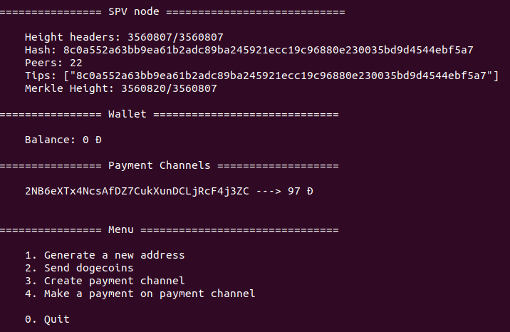

# Dogecoin SPV wallet

The Dogecoin SPV wallet is a wallet that implements the Simplified Payment Verification protocol. This wallet doesn't rely on any third party service to work and instead connect directly to Dogecoin nodes to collect the transactions that it is interested in.


## Getting started

You can download the latest release on [the github release page](https://github.com/BitcoinAmiens/dogecoin-spv-node/releases/latest).

Extract the folder from the archive and run `./dogecoin-spv start` from your terminal.


**Linux**
```
$ tar -xvf dogecoin-spv-0.4.1-linux-x64.tar.gz
$ cd dist/linux/
$ ./dogecoin-spv start
```

**Windows**

TODO

**macOS**

TODO

## CLI

Dogecoin SPV wallet is a command line wallet. It means it doesn't have GUI (yet).

```
  Dogecoin SPV wallet (beta)

  !!! Important !!!
  This is a beta version. It only support regtest and testnet network.
  
  Usage
    $ dogecoin-spv <command>
  
  Commands
    start          Start the spv node

  Options
    --regtest, -r  Start in regtest mode
    --dev, -d      Start node as dev (local data folder and not user)

  Examples
    $ dogecoin-spv start --regtest

```

## Screenshots




## More

* [Contributing](/contributing)
* [FAQ](/FAQ)
* [Development](/development)

